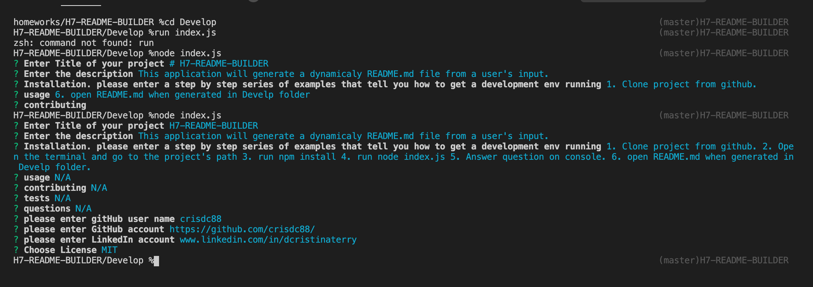
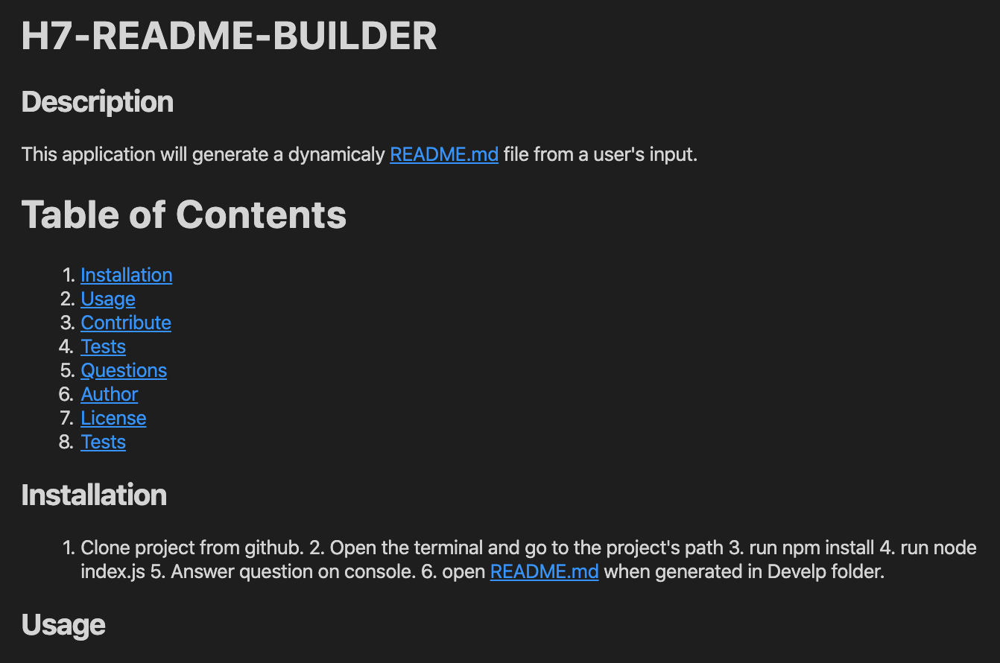

# H7-README-BUILDER

This application will generate a dynamicaly README.md file from a user's input.

## GettingStarted

Project Location

>[Project's GitHub repository](https://github.com/crisdc88/H7-README-BUILDER)

## Prerequisites

* npm
* Visual Studio Code

## Built With

* Node js

## Installation

1. Clone project from github.
2. Open the terminal and go to the project's path
3. run npm install
4. run node index.js
5. Answer question on console.
6. open README.md when generated in Develp folder

## Deployed Link

>N/A

## Code-Snippets

1. Open index.js
2. Find the following code showing API calls to gitHub's API, and adding information to the response in order to generate the README.md file.

```sh

  inquirer.prompt(questions).then(function (response) {
        let githubAccount = response.githubusername;
        let gitHubURL = "https://api.github.com/users/" + githubAccount + "/events/public";

        axios.get(gitHubURL).then(function (axiosResponse) {
            // console.log(axiosResponse.data);

            let avatar = axiosResponse.data[0].actor.avatar_url;
            // console.log("this is the avatar",avatar);
            response["avatar"] = avatar;

            let gHEmail = axiosResponse.data[0].payload.commits[0].author.email;
            // console.log("inside ", gHEmail);
            response["email"] = gHEmail;

            // writing to file:
            fs.appendFile("README.md", generateMarkdown(response) + "\n", function (error) {
                if (error) {
                    console.log("there was an error writing into the file");
                }
            })
        });
    })

```

## Screen Shots






## Author


D. Cristina Terry

GitHub: [https://github.com/crisdc88/](https://github.com/crisdc88/),

LinkedIn: [www.linkedin.com/in/dcristinaterry](www.linkedin.com/in/dcristinaterry)


## License


